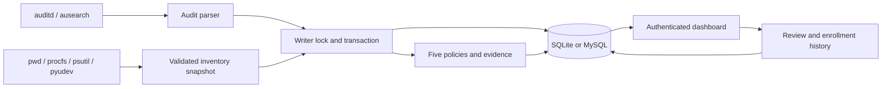
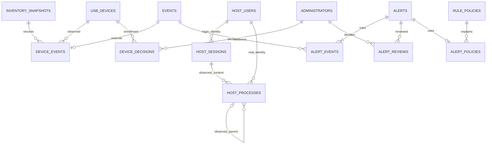

# Architecture and project explanation

KernelGuard combines Linux activity metadata, relational persistence, explainable
policies and human review. It runs in user space; it does not modify the kernel.

## Responsibilities

- core.py defines the event schema, original login/file rules and ingestion transaction
  contract. activity_rules.py adds privileged execution and distinct-path correlation.
- parser.py groups audit records by timestamp/serial, normalizes paths and separates
  login, real and effective UIDs. It excludes command arguments, PROCTITLE and contents.
- inventory/models.py validates complete snapshot structure and rejects ambiguous
  duplicate identities. collector.py uses operating-system libraries to collect it.
- inventory/schema.py separates users, sessions, processes, devices, snapshots and
  decisions into relational tables. service.py computes transitions atomically.
- inventory/routes.py presents paginated inventory and enrollment decisions.
- auth.py uses Flask sessions and Werkzeug hashes; reviews.py validates state changes.
- locking.py serializes cooperating writes. CLI loops release locks between polls.
- web.py/templates render events, immutable policy snapshots and evidence relationships.

## OS concepts

The kernel/audit subsystem emits syscall metadata; ausearch supplies grouped events.
AUID denotes the login identity, UID the real identity and EUID the effective privilege.
Failed-login account names are attempted identities, not authenticated users.
Snapshots use pwd for the current account inventory, /proc for boot/audit-session
metadata, psutil for processes and pyudev for USB device properties.

Process identities include host, source, boot, PID and start time. Parent foreign keys
are established only when both processes were observed together and the parent
started earlier. Equal-time or absent parents remain unknown. Boot-scoped session
keys prevent a reused audit-session number from merging across boots. A process
snapshot is not a full historical execution trace; short-lived processes may be missed.

Process scans can be incomplete because of permissions or exit races. Those snapshots
carry warnings and do not infer that unseen processes exited. Complete later scans
may mark old records absent. Every screen retains last-seen time instead of claiming
that a historical record is running now. Snapshot collection is not an atomic OS freeze.

USB enumeration excludes root hubs. Identity uses vendor/product/serial when present,
otherwise vendor/product/physical port. Cloned identifiers are possible; duplicate
fingerprints within a snapshot cause rejection. USB state is sampled, so attach/remove
cycles between polls may be missed. Enumeration failure cancels the snapshot rather
than fabricating removals. A disappearance means absent from a complete enumeration,
not proof of when or why a device was unplugged.

## DBMS concepts and relationships

Keys, foreign keys and unique identifiers enforce relational integrity. Join tables
represent evidence relationships without comma-separated IDs. Indexed host/time,
process-context and decision-history queries support the UI. MySQL tables use InnoDB
and case-sensitive utf8mb4_bin collation; SQLite explicitly enables foreign keys.

Inventory changes, snapshot IDs, device events, alerts and policy links share one
transaction. Exceptions roll back the entire snapshot. Audit data and checkpoint
advancement also share a transaction. Replay hashes provide duplicate suppression,
not tamper-proof evidence. Current user labels intentionally represent inventory
state; event labels remain historical snapshots and are not overwritten on rename.

A review carries an expected previous decision ID. Under the writer lock, stale
submissions are rejected, preventing lost updates. Old decisions and event evidence
remain unchanged. Demo and live origins are separate for identity, enrollment and rules.

## Five rules

1. Repeated failed login authentications in a configured inclusive time window.
2. Successful protected-path access outside configured local allowed hours.
3. Successful access to a threshold of distinct protected paths in one user/session
   and matching boot context. The rule does not measure bytes or infer copying.
4. Selected root-effective executable launched from a known non-root login identity.
5. First-seen/reappearing USB identity without an administrator enrollment decision.

Each alert stores a severity and exact policy snapshot. Legitimate backup activity,
administration or a new lab USB device can trigger a policy match. Human review is
necessary. No trained model, automatic quarantine, attack blocking or attribution
of USB activity to a person is implemented or claimed.

## Library references

- [psutil process identity and enumeration](https://psutil.readthedocs.io/stable/)
- [pyudev device enumeration](https://pyudev.readthedocs.io/en/latest/guide.html)
- [Flask security guidance](https://flask.palletsprojects.com/en/stable/web-security/)
- [Werkzeug password hashing](https://werkzeug.palletsprojects.com/en/stable/utils/)
- SQLAlchemy supplies transactions, typed tables, parameterized values and database dialects.
- Pydantic validates settings and snapshot contracts; Portalocker handles OS file locks.
- Waitress serves the Flask application without the development server.
