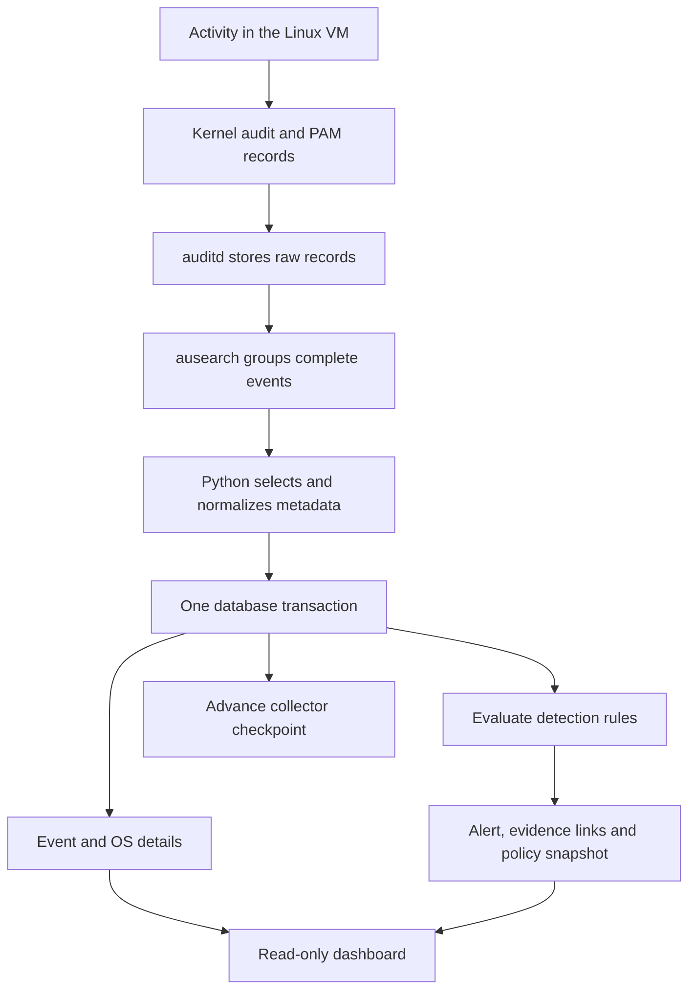
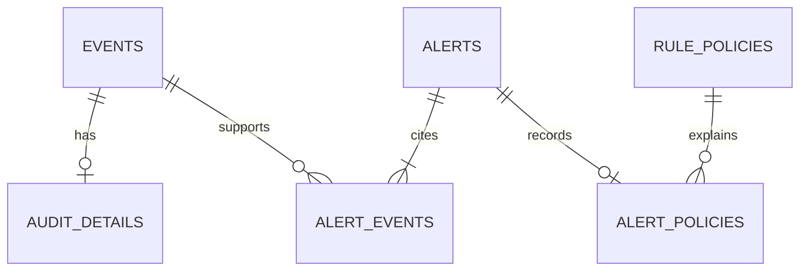

# KernelGuard: detailed project explanation

This document preserves the historical baseline. Read the current
[architecture](../ARCHITECTURE.md) and [operations guide](../OPERATIONS.md) for implemented features.

## 1. Problem and scope

KernelGuard is a local Linux activity-monitoring prototype. It asks whether activity
matches a configured policy after a person has reached a login service or obtained
an account. For Phase 2, the system focuses on two observations: repeated failed
login authentication and successful access to selected files outside allowed hours.

The operating system produces evidence; KernelGuard collects selected metadata,
stores relationships in a database and attaches an understandable explanation to
each alert. A successful demonstration begins with a real event in the Linux VM
and ends with the corresponding database row and evidence page.

A failed login can originate from an outsider. An after-hours read can be legitimate.
These are suspicious-activity indicators, not proof of an insider attack. The project
title describes its intended use; it does not establish the identity or intent of
every person whose activity matches a rule.

Phase 2 runs on one host. USB inventory, bulk-copy correlation and privileged-command
rules remain Phase 3 work. The current application does not prevent actions or capture
passwords, typed text, command arguments or file contents.

## 2. Components and data flow

The collector is a user-space Python process. It launches `ausearch` as a subprocess
and reads its output. Python does not intercept system calls itself. The five-second
poll interval means near-real-time behavior with additional audit completion and
processing delay, not instantaneous notification.

The dashboard is a separate Flask process. It reads stored data and refreshes when
the administrator requests a page. It does not need access to the raw audit log.

## 3. OS concepts used correctly

### User space, kernel space and system calls

An application such as `cat` makes a system call to open a file. The kernel performs
the operation and applies file access controls. A configured audit rule causes relevant
metadata to appear in the audit stream. A SYSCALL record can be accompanied by CWD,
PATH and other records sharing an audit timestamp and serial number.

KernelGuard groups those records before creating event rows. Two paths from one
system call can produce two file-event rows; therefore an event-row count is not a
system-call count. The current audit rule watches read/write-related operations in
one directory for native 64-bit processes. It is not a full host process inventory.

### Identity: auid, uid and euid

These three fields answer different questions:

| Audit field | Meaning in the evidence | Example after a user runs sudo |
|---|---|---|
| `auid` | Login identity associated with the process | 1001 |
| `uid` | Real user identity recorded for the process | 0 |
| `euid` | Effective identity used for privilege checks | 0 |

The example is illustrative; actual identities depend on how the program changes
credentials. KernelGuard stores all three when supplied. It also retains the audit
session, PID, syscall number, architecture and file inode/device metadata.

For file-event display, `events.account` is a snapshot label derived from `auid` when
known, otherwise the real UID. The older `events.uid` column is that selected actor
UID, not a canonical real UID. Use `audit_details.real_uid` for the real UID. This
compatibility choice avoids silently changing the meaning of previously stored rows.

A failed login's `acct` is an attempted account name. A USER_AUTH record may identify
the authentication service's UID without supplying an effective UID. The parser keeps
the effective UID unknown in that case. Unset IDs such as 4294967295 become SQL NULL
in the new OS detail table.

Field meanings and correlated record examples are documented by [Linux Audit/Red Hat](https://docs.redhat.com/en/documentation/red_hat_enterprise_linux/7/html/security_guide/sec-understanding_audit_log_files).

### Permissions and least privilege

The protected folder is a monitored lab directory. Its name does not itself deny
access. Linux permissions determine whether an operation succeeds; the after-hours
rule reports successful operations outside policy hours. Failed operations remain
visible without being called successful access.

The collector needs audit-log access. The supplied lab command uses sudo for that
component. The dashboard runs as a regular user on loopback. Separate MySQL credentials
can give the dashboard SELECT-only access; the collector needs read/write access.

### Processes and synchronization

The project stores PID as event-time evidence. PIDs can be reused; PID alone is not
a permanent process identity. The prototype does not construct a complete process
tree or recover arbitrary historical processes from a PID.

The writer lock prevents cooperating KernelGuard CLI writers from ingesting concurrently.
SQLite uses an OS advisory file lock through Portalocker; MySQL uses a named connection-owned lock. This
is a concrete use of mutual exclusion around a shared resource. The database still
provides its own transaction and constraint mechanisms. A separate administrator or
program can ignore the application lock, so it is not a security boundary.

### Recovery and checkpointing

The collector loads the previous `ausearch` checkpoint, copies it to a temporary file,
and runs the search. It commits the new checkpoint only in the transaction that stores
the events and alerts. If that transaction fails, both data and checkpoint movement
roll back. The next poll can retry the same source records.

This is application-level recovery using audit checkpoints and database transactions.
It is not an implementation of OS process checkpoint/restore or database write-ahead
logging. Audit rotation can remove evidence before it is consumed. On an invalid
checkpoint the collector stops, and recovery must acknowledge any coverage gap.
See the [ausearch manual](https://man7.org/linux/man-pages/man8/ausearch.8.html).

## 4. Database design

| Table | Primary key | Responsibility |
|---|---|---|
| `events` | `id` | Common activity snapshot; `source_id` is unique |
| `audit_details` | `event_id`, also a foreign key | Optional detailed OS evidence for one event |
| `alerts` | `id` | Rule name, time, severity and explanation |
| `alert_events` | `(alert_id, event_id)` | Evidence relationship between alerts and events |
| `rule_policies` | `id` | Unique rule version and canonical parameter snapshot |
| `alert_policies` | `alert_id`, also a foreign key | The policy used for one alert |
| `checkpoints` | `name` | Collector cursor and last successful poll |

New alerts have a policy link. Older alerts may lack one because no original snapshot
was recorded. The UI states that limitation instead of attaching today's policy to
an old decision. Re-importing source records can fill missing OS detail rows without
adding duplicate events or recreating old alerts.

### Keys, normalization and relationships

The evidence join table avoids storing a comma-separated list of event IDs in an alert.
Its composite primary key prevents the same event being linked twice to the same alert.
Foreign keys reject references to missing events, alerts or policies.

OS-specific optional fields live in a one-to-one extension table. Policy configuration
is stored once per rule/version/parameter combination and shared by matching alerts.
The policy hash identifies configuration, just as the source hash identifies input.
Neither hash proves that the database is tamper-proof.

The model is a relational event store with deliberate snapshots, not the full inventory
schema proposed for Phase 3. Do not claim that adding more tables alone proves 3NF.
In particular, parameters are retained as an opaque canonical JSON document for exact
reproduction, not decomposed into a general relational rule editor. Account strings
are historical observations, not foreign keys to authenticated users.

### ACID and transactions

The MySQL schema explicitly uses InnoDB. Python wraps ingestion in `engine.begin()`.
SQLAlchemy commits on success and rolls back when the block raises an exception.
This is use of an existing transaction API, as documented in [SQLAlchemy connections](https://docs.sqlalchemy.org/en/20/core/connections.html).

- **Atomicity:** event, OS detail, alert, policy link, evidence and checkpoint updates
  are committed together for a collector batch.
- **Consistency:** PK, UNIQUE and FK constraints preserve defined relationships;
  parser and configuration validation enforce additional application rules.
- **Isolation:** the application serializes its writers; the database controls
  concurrent access according to its configured isolation behavior.
- **Durability:** committed data relies on the storage engine and its actual
  configuration. The prototype does not independently guarantee power-loss recovery.

SQLite preview also enables foreign keys, which are not assumed to be automatically
enforced on every SQLite connection. MySQL's FK requirements are described in the
[MySQL manual](https://dev.mysql.com/doc/refman/8.4/en/create-table-foreign-keys.html).

### Queries and indexes

`(host, account, timestamp)` supports lookup of a subject's recent activity.
`(kind, timestamp)` supports event-type/time access patterns. Indexes cost storage and
write work, so they should be connected to actual queries and checked with EXPLAIN.
The code uses SQLAlchemy bound values rather than assembling SQL from usernames.

`sql/analysis.sql` includes GROUP BY summaries, evidence joins, policy lookup and
EXPLAIN examples. The production login rule additionally excludes evidence already
used by a previous login episode. A simple COUNT query alone is not that entire rule.

## 5. Detection behavior

### Repeated failed login authentication

The parser accepts failed USER_AUTH records from the configured implementation's
supported login executables: sshd variants and console login. It does not count
USER_LOGIN again or treat every failed sudo prompt as a login failure.

For each new event, the rule considers the same host, attempted account and data
origin within a 300-second inclusive time window. Five unused failures trigger a
severity-60 alert. Those events are linked to that episode. Further failures require
another threshold's worth of unused evidence to produce a new episode.

If an older event arrives late, the code also examines already-stored window endings
that it could affect. This allows a late fifth failure to complete a previously
incomplete pattern. Evidence groups are greedy and may differ with arrival order;
the prototype does not promise a unique optimal grouping across every ordering.

The time-window comparison uses integer seconds. Original fractional audit time remains
in `audit_details.audit_timestamp`, but rule boundaries have one-second granularity.
Missing attempted account names group as `unknown`, an acknowledged limitation.

### After-hours protected-file access

The default protected root is `/srv/kernelguard/protected`. Allowed time is 09:00
inclusive to 18:00 exclusive in Asia/Kolkata. A successful access outside that interval
produces severity 70. A root/path-parent comparison avoids matching a similarly named
directory such as `/srv/kernelguard/protected-other`.

An interval such as 22:00–06:00 is supported. Timestamps are stored as Unix time and
displayed in UTC; only policy evaluation converts to the configured timezone.

Path handling covers ordinary absolute paths, CWD-relative paths and UTF-8 hexadecimal
audit names. It is not a full filesystem reconstruction engine: symlinks, mount namespaces,
openat paths relative to arbitrary directory descriptors, invalid UTF-8 names and hostile
log mutation require broader parsing and testing. Inode/device values retain useful
evidence but are not currently used to resolve those cases.

Scores are project-defined severity values. They are not ML outputs or probabilities.
The system stores the rule version and relevant settings with each new alert.

## 6. A concrete walkthrough

A regular lab user opens a dummy protected file at 22:00 local time. Linux permits
the read and records a successful watched syscall. The parser joins the syscall and
path records, retaining the original login identity and the file path. In one database
transaction, KernelGuard inserts the event and its OS details, detects that 22:00 is
outside the configured interval, saves an alert and policy, links the event as evidence,
and advances the collector cursor. Refreshing the dashboard shows the explanation.

At 10:00, the same successful access is stored without the after-hours alert. A failed
access at 22:00 is also stored without being mislabelled as a successful access.

The bundled default synthetic fixture contains five failed authentications, one
successful after-hours read, two allowed-hours reads and one failed read. On an empty
database it produces nine events and two alerts. It exercises the data path; it cannot
prove that audit rules work on a real Linux kernel.

## 7. Code reading order

1. `config.example.json` and `kernelguard/config.py`: understand the policy and Pydantic field definitions.
2. `linux/kernelguard.rules`: see what the OS is asked to record.
3. `kernelguard/parser.py`: follow raw records into selected metadata.
4. `kernelguard/core.py`: inspect tables, duplicate checks, policy snapshots and rules.
5. `kernelguard/locking.py`: understand exclusive writer access.
6. `kernelguard/__main__.py`: trace polling, checkpoints and transaction boundaries.
7. `kernelguard/web.py` and templates: follow SQL results into the administrator view.
8. `tests/`: study normal cases, failure cases and the limits of validation.

Pydantic handles strict field types, numeric ranges, unknown settings and structured
validation errors. A short project validator checks timezone availability, distinct
start/end hours and path normalization. Portalocker replaces the manual Windows/POSIX
lock branches. The project's detection algorithms, SQL schema and transaction boundaries
remain explicit, so using libraries does not remove the concepts needed for the viva.

## 8. Viva preparation

**Why combine OS and DBMS?** The OS produces low-level observations. The database
retains them and expresses relationships and time windows needed for explanations.

**Why MySQL if logs already exist?** Raw records are useful evidence, but a relational
schema makes cross-event queries, integrity checks and alert/evidence joins practical.

**Did you modify the kernel?** No. The project uses the existing Linux audit subsystem
and implements a user-space collector, rules and dashboard.

**Which OS algorithms did you implement?** No scheduler, paging algorithm or deadlock
detector. The implemented work concerns auditing, process/identity metadata, permissions,
subprocesses and writer mutual exclusion.

**Why distinguish login UID and effective UID?** They distinguish the initiating login
context from the identity under which a process operates after credential changes.

**What happens after a crash?** An uncommitted ingestion batch rolls back; its checkpoint
does not advance. Source IDs suppress duplicates during replay. Missing source logs
remain a coverage gap.

**Why is the dashboard read-only?** Phase 2 focuses on observable detection and evidence.
Acknowledgement, authentication and operational responses are future work.

**How do you measure correctness?** Automated positive/negative tests plus a real Linux
and MySQL acceptance run. Synthetic demo output is labelled separately. False-positive
rates and throughput cannot be claimed without an actual measured experiment.

**Is the code entirely student-written?** The implementation was developed with AI
assistance and external libraries. Explain your actual contribution and consult
`ORIGINALITY_AND_ATTRIBUTION.md` for an accurate acknowledgement.
