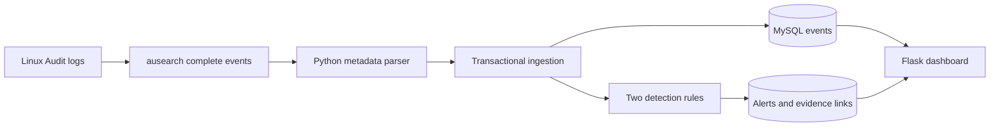
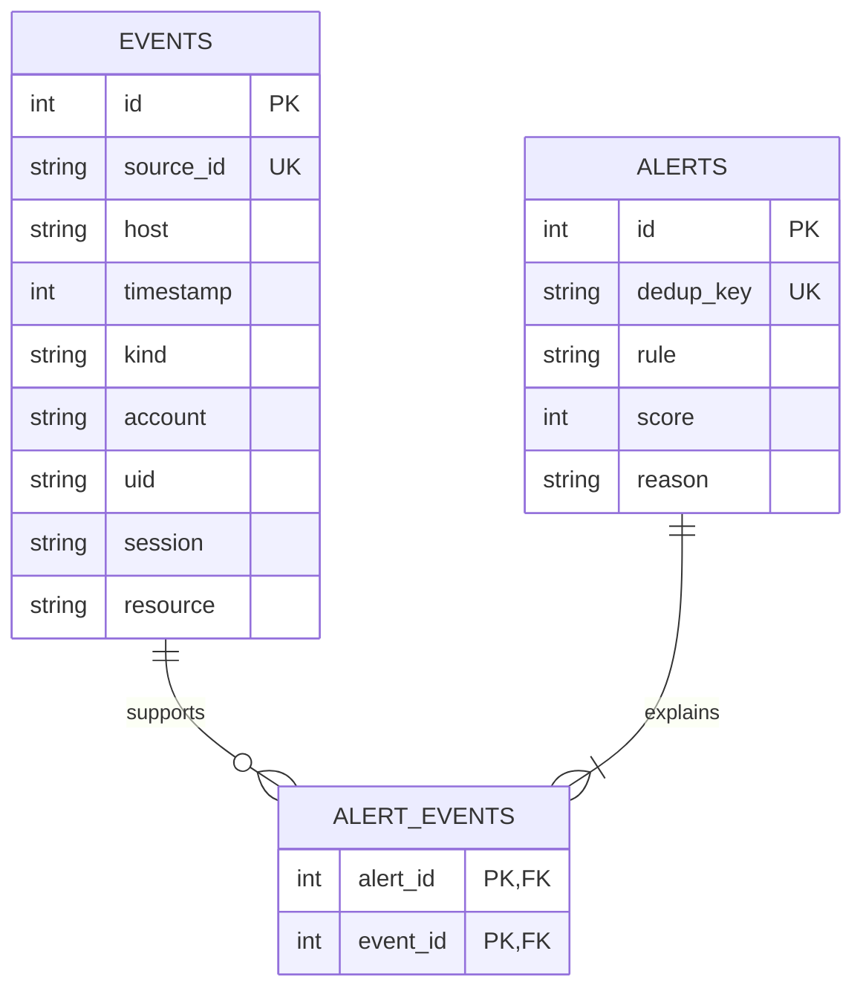

# Baseline handover (historical)

Historical baseline only. For the complete current system, use
[the operations guide](../OPERATIONS.md) and [architecture](../ARCHITECTURE.md).

## Objective and demonstration

Show one complete OS-to-DBMS monitoring cycle: Linux audit event → metadata parser →
relational event row → detection rule → evidence-linked dashboard alert.

For the Windows synthetic demonstration:

1. Run `scripts/start-demo.ps1` from PowerShell.
2. Show the explicit SQLite and synthetic-data notice.
3. Show 9 stored events and 2 alerts using the default configuration.
4. Open the failed-login alert: 5 supporting authentication events.
5. Open the protected-file alert: 1 successful out-of-hours event.
6. Filter activity by `file_access`: normal-hours and failed accesses are stored too.
7. Stop the server, repeat the demo import, and show unchanged counts.
8. Explain that `Not live` is correct until the Linux collector actually polls.

For the assessed real demonstration, complete `LINUX_SETUP.md` and use the real MySQL
database. Do not present synthetic screenshots as proof of Linux collection.

## Architecture

## OS and DBMS concepts to explain

Read `PROJECT_EXPLAINED.md` for the full walkthrough and `OS_DBMS_REVIEW.md` for
the correctness audit. Three additive tables now retain OS details and historical
policies: `audit_details`, `rule_policies`, and `alert_policies`. The full current ER
diagram is in the explanation guide; the diagram above shows the core evidence model.

OS: audit events, process identifiers, login UID versus effective UID, watched file access,
authentication records, permissions, and collector lifecycle.

DBMS: primary and foreign keys, many-to-many evidence relationships, unique constraints,
parameterized queries, indexes, time-window analysis and atomic transactions.
Phase 2 intentionally uses event identity snapshots; persistent user/session/device
inventory tables in the original proposal remain Phase 3 work.

## Verification

Run `python -m pytest -q`. The suite checks threshold boundaries, account/host/source
isolation, late arrivals, timezones/overnight hours, path boundaries, failed access,
multi-record and hex parsing, duplicate replay, transaction rollback, collector errors,
checkpoint persistence, HTML escaping, filters and evidence pages.
Collector subprocess behavior is mocked on Windows; this does not verify auditd itself.
The optional MySQL integration test runs only against an explicitly configured disposable
test database. See `tests/test_mysql.py` for its environment variable.

## Remaining Phase 3 scope

- USB/device inventory and unknown-device detection.
- Privileged-command rules and bulk-file-activity correlation.
- Persistent users/sessions inventory and richer process relationships.
- Administrator authentication and alert acknowledgement workflow.
- Broader performance evaluation, false-positive analysis and deployment hardening.

No trained model, kernel driver, blocking action or file-content capture is included.
